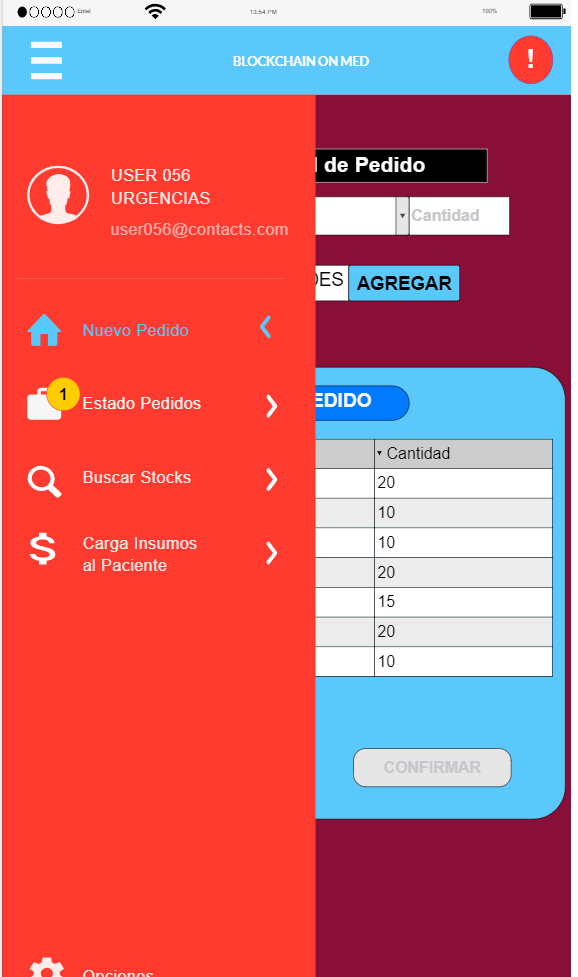
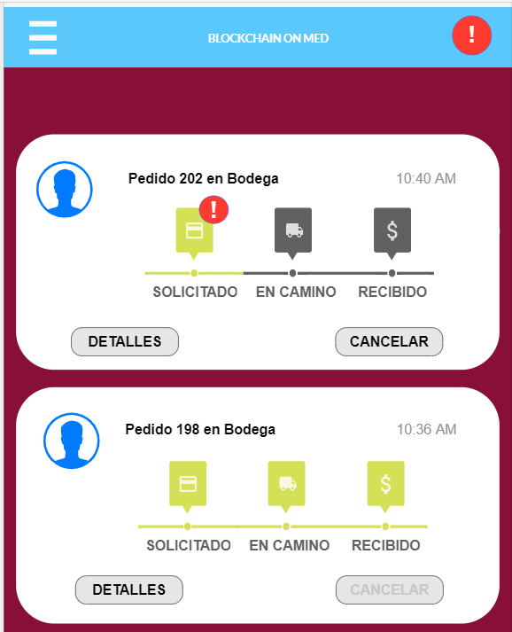
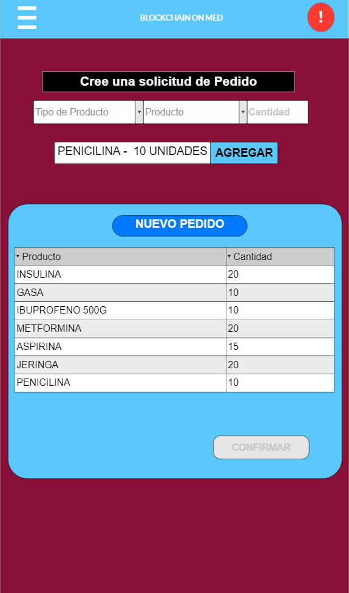

# Funcionalidades aplicación web Blockchain

## Descripción

Ejemplificación de los .JSON que se utilizan para las llamadas a la API de la aplicación web.
Parámetros con '#' representan los parámetros que varían.

## Encargo

### Crear encargo (SolicitarPedidoProveedor)

- POST

~~~~
{
  "$class": "org.acme.shipping.externalchain.SolicitarPedidoProveedor",
  "shipmentId": #"SHIP_003",
  "listaPedido": {
    "$class": "org.acme.shipping.externalchain.listaStock",
    "insumos": [
      #"JERINGA"
    ],
    "cantidades": [
      #100
    ]
  },
  "contract": "resource:org.acme.shipping.externalchain.Contract_Proveedores_Clinica#CON_002"
}
~~~~

- Respuesta

Tiene que aparecer un mensaje de creación satisfactoria de Encargo, y que cree una notificación.

## Mockups

### Menu

### Visualización del Encargo

### Creación de Encargo

